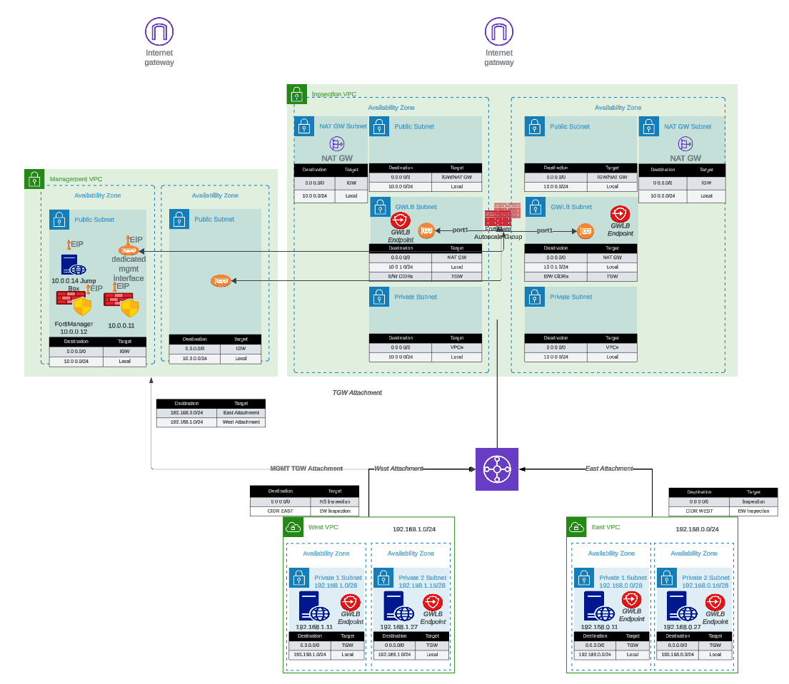

## Welcome

This documentation provides comprehensive guidance for deploying FortiGate autoscale groups in AWS using the **FortiGate Autoscale Simplified Template**. This template serves as an accessible wrapper around Fortinet's enterprise-grade [FortiGate Autoscale Templates](https://github.com/fortinetdev/terraform-aws-cloud-modules), dramatically reducing deployment complexity while maintaining full architectural flexibility.

## Purpose and Scope

The official FortiGate autoscale templates available in the [terraform-aws-cloud-modules](https://github.com/fortinetdev/terraform-aws-cloud-modules) repository deliver powerful capabilities for deploying elastic, scalable security architectures in AWS. However, these templates require:

- Deep familiarity with complex Terraform variable structures
- Strict adherence to specific syntax requirements
- Extensive knowledge of AWS networking and FortiGate architectures
- Significant time investment to understand configuration dependencies

The **Simplified Template** addresses these challenges by:

- **Abstracting complexity**: Encapsulates intricate configuration patterns into intuitive boolean variables and straightforward parameters
- **Accelerating deployment**: Reduces configuration time from hours to minutes through common-use-case defaults
- **Maintaining flexibility**: Retains access to advanced features while providing sensible defaults for standard deployments
- **Reducing errors**: Minimizes misconfiguration risks through validated input patterns and clear parameter descriptions

## What This Template Provides

The Simplified Template enables rapid deployment of FortiGate autoscale groups by simplifying configuration of:

### Core Infrastructure
- **Network architecture**: VPC creation or integration with existing network resources
- **Subnet design**: Automated subnet allocation across multiple Availability Zones
- **Transit Gateway integration**: Optional connectivity to existing Transit Gateway hubs
- **Load balancing**: AWS Gateway Load Balancer (GWLB) configuration and target group management

### Autoscale Configuration
- **Capacity management**: Minimum, maximum, and desired instance counts
- **Scaling policies**: CPU-based thresholds and CloudWatch alarm configuration
- **Instance specifications**: FortiGate version, instance type, and AMI selection
- **High availability**: Multi-AZ distribution and health check parameters

### Licensing and Management
- **Licensing flexibility**: Support for BYOL, PAYG, and FortiFlex licensing models
- **License automation**: Automated license file distribution or token generation
- **Hybrid licensing**: Configuration for combining multiple license types
- **FortiManager integration**: Optional centralized management and policy orchestration

### Security and Access
- **Management access**: Dedicated management interfaces or combined data/management design
- **Key pair configuration**: SSH access for administrative operations
- **Security groups**: Automated creation of appropriate ingress/egress rules
- **IAM roles**: Lambda function permissions for license and lifecycle management

### Egress Strategies
- **Elastic IP allocation**: Per-instance EIP assignment for consistent source NAT
- **NAT Gateway integration**: Shared NAT Gateway configuration for cost optimization
- **Distributed egress**: Traffic hairpins through FortiGate for transparent bump-in-the-wire inspection, then egresses via existing NAT Gateways or Internet Gateways in spoke VPCs
- **Route management**: Automated routing table updates for egress traffic flows

## Common Use Cases

This template is specifically designed for the most frequently deployed FortiGate autoscale architectures:

1. **Centralized Inspection with Transit Gateway**: Single inspection VPC serving multiple spoke VPCs through Transit Gateway routing
2. **Distributed Inspection**: GWLB endpoints placed directly in spoke VPCs for bump-in-the-wire inspection without Transit Gateway overhead
3. **Dedicated Management VPC**: Isolated management plane for FortiManager/FortiAnalyzer integration with production traffic inspection VPC
4. **Hybrid Licensing Architectures**: Cost-optimized deployments combining BYOL/FortiFlex baseline capacity with PAYG burst capacity
5. **Existing Infrastructure Integration**: Deployment into pre-existing VPCs, subnets, and Transit Gateway environments

## How It Works

The Simplified Template approach:

1. **Variable Abstraction**: Translates complex nested map structures into simple boolean flags and direct parameters
2. **Conditional Logic**: Automatically enables or disables features based on use-case selection
3. **Default Values**: Provides production-ready defaults for parameters not requiring customization
4. **Validation**: Implements input validation to catch configuration errors before deployment
5. **Module Invocation**: Dynamically constructs proper syntax for underlying enterprise templates
6. **Output Standardization**: Presents consistent outputs regardless of architecture variation

## Prerequisites

Before using this template, ensure you have:

### Required Knowledge
- Basic understanding of AWS networking concepts (VPCs, subnets, route tables)
- Familiarity with Terraform workflow (`init`, `plan`, `apply`, `destroy`)
- General understanding of FortiGate firewall concepts
- AWS account with appropriate permissions for VPC, EC2, Lambda, and IAM resource creation

### Required Tools
- **Terraform**: Version 1.0 or later ([Download](https://www.terraform.io/downloads))
- **AWS CLI**: Configured with appropriate credentials ([Installation Guide](https://aws.amazon.com/cli/))
- **Git**: For cloning the repository
- **Text Editor**: For editing `terraform.tfvars` configuration files

### AWS Resources
- **AWS Account**: With permissions to create VPCs, subnets, EC2 instances, Lambda functions, and IAM roles
- **Service Quotas**: Sufficient EC2 instance limits for desired autoscale group size
- **S3 Bucket** (for BYOL): Storage location for FortiGate license files
- **Key Pair**: Existing EC2 key pair for SSH access to FortiGate instances

### Optional Resources
- **FortiManager**: For centralized management (if integration is desired)
- **FortiAnalyzer**: For centralized logging and reporting
- **Transit Gateway**: If integrating with existing hub-and-spoke architecture
- **FortiFlex Account**: If using FortiFlex licensing model

## Documentation Structure

This guide is organized into the following sections:

1. **Introduction** (this section): Overview, purpose, and prerequisites
2. **Overview**: Architecture patterns, key benefits, and solution capabilities
3. **Licensing**: Detailed comparison of BYOL, PAYG, and FortiFlex licensing options
4. **Solution Components**: In-depth explanation of architectural elements and configuration options
5. **Templates**: Step-by-step deployment procedures and configuration examples

## Additional Resources

For comprehensive FortiGate and FortiOS documentation beyond the scope of this deployment guide, please reference:

- **FortiGate Documentation Portal**: [docs.fortinet.com](https://docs.fortinet.com/)
- **FortiGate AWS Deployment Guides**: [docs.fortinet.com/document/fortigate-public-cloud/](https://docs.fortinet.com/document/fortigate-public-cloud/)
- **AWS Marketplace FortiGate Listings**: [AWS Marketplace](https://aws.amazon.com/marketplace/seller-profile?id=a979b519-0d9d-4a0b-b177-b00ff8204222)
- **Fortinet Developer Network (FNDN)**: [fndn.fortinet.net](https://fndn.fortinet.net) (requires registration)
- **FortiGate Administration Guide**: [docs.fortinet.com/fortigate/admin-guide](https://docs.fortinet.com/product/fortigate/)
- **Terraform AWS Cloud Modules Repository**: [GitHub - fortinetdev/terraform-aws-cloud-modules](https://github.com/fortinetdev/terraform-aws-cloud-modules)

## Support and Feedback

For technical support:
- **Enterprise Template Issues**: Report issues on the [terraform-aws-cloud-modules GitHub repository](https://github.com/fortinetdev/terraform-aws-cloud-modules/issues)
- **FortiGate Technical Support**: Open support tickets at [FortiCare Support Portal](https://support.fortinet.com)
- **AWS Infrastructure Issues**: Contact AWS Support through your AWS account

For documentation feedback or Simplified Template enhancement requests, please reach out through your Fortinet account team or technical contacts.

## Getting Started

Ready to deploy? Proceed to the [Overview](../2_overview/) section to understand the architecture patterns available, or jump directly to the [Templates](../5_templates/) section to begin configuration and deployment.
