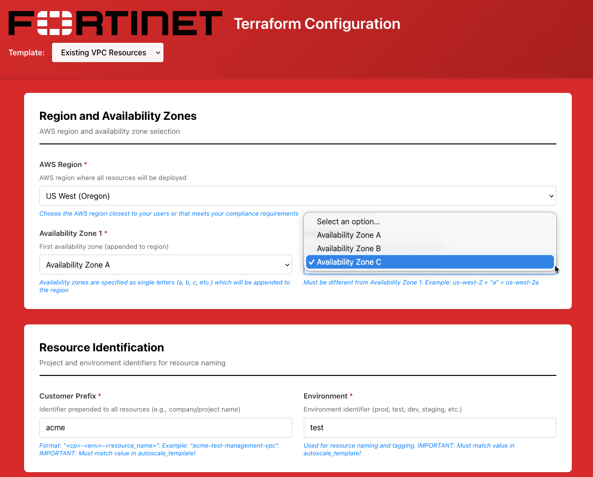

## Overview

This guide walks you through configuring the `existing_vpc_resources` template using the Web UI. This template creates the base infrastructure including management VPC, Transit Gateway, spoke VPCs, and test instances.

{}
**Deploy existing_vpc_resources FIRST** before deploying autoscale_template or ha_pair. You must choose a deployment mode during configuration.
{}

---

## Step 1: Select Template

1. Open the UI at http://localhost:3000
2. In the **Template** dropdown at the top, select **existing_vpc_resources**
3. The form will load with default values


---

## Step 2: Region Configuration

### AWS Region

1. Locate the **Region Configuration** section
2. Click the **AWS Region** dropdown
3. Select your desired region (e.g., `us-west-2`)

{}
**AWS Integration**

If AWS credentials are configured, the dropdown will show all available regions. Without credentials, type the region name manually.
{}

### Availability Zones

4. **Availability Zone 1** dropdown will automatically populate with zones for your selected region
5. Select first AZ (e.g., `a`)
6. **Availability Zone 2** dropdown updates automatically
7. Select second AZ - **must be different from first** (e.g., `c`)



---

## Step 3: Customer Prefix and Environment

These values tag all resources for identification and **must match** between existing_vpc_resources and your chosen FortiGate template.

### Customer Prefix (cp)

1. Enter your company or project identifier (e.g., `acme`)
2. **Rules:**
   - Lowercase letters, numbers, and hyphens only
   - Will prefix all resource names: `acme-test-vpc`

### Environment (env)

3. Enter environment name (e.g., `test`, `prod`, `dev`)
4. **Rules:**
   - Lowercase letters, numbers, and hyphens only
   - Will be included in resource names: `acme-test-vpc`

{}
**TODO: Add diagram - cp-env-fields**

Show:
- Customer Prefix field with "acme" entered
- Environment field with "test" entered
- Help text explaining naming convention
- Example showing result: "acme-test-management-vpc"
{}

{}
**Configuration Inheritance**

The UI automatically passes your `cp` and `env` values to autoscale_template and ha_pair. These fields will appear as read-only (inherited) in the subsequent templates.
{}

---

## Step 4: Deployment Mode Selection (REQUIRED)

**This is the most important decision** - choose ONE deployment mode based on which FortiGate template you'll deploy next.

### Option A: AutoScale Deployment Mode

**Choose this if** you plan to deploy [autoscale_template](../3_2_autoscale_template/):

1. Check the box: **Enable AutoScale Deployment**
2. Uncheck: **Enable HA Pair Deployment**

This creates GWLB subnets (indices 4 & 5) for Gateway Load Balancer endpoints.

### Option B: HA Pair Deployment Mode

**Choose this if** you plan to deploy [ha_pair](../3_3_ha_pair/):

1. Check the box: **Enable HA Pair Deployment**
2. Uncheck: **Enable AutoScale Deployment**

This creates HA sync subnets (indices 10 & 11) for FGCP cluster synchronization.

{}
**TODO: Add diagram - deployment-mode-selection**

Show:
- Two checkboxes
- Enable AutoScale Deployment [[x]]
- Enable HA Pair Deployment [ ]
- Warning message: "These modes are mutually exclusive - choose one"
- Help text explaining what each mode creates
{}

{}
**What This Choice Does**

Your selection controls which subnet configuration fields appear:
- **AutoScale mode**: Shows GWLB subnet configuration fields
- **HA Pair mode**: Shows HA Sync subnet configuration fields

To change modes after deployment, you'll need to destroy and recreate the infrastructure.
{}

---

## Step 5: Component Flags

Enable or disable optional components based on your needs.

### Management VPC

Check **Enable Build Management VPC** to create:
- Management VPC with public/private subnets
- Internet Gateway
- Security groups
- Optional: FortiManager, FortiAnalyzer, Jump Box

Enable this if you want management infrastructure deployed in a separate VPC.

### Spoke VPCs and Transit Gateway

Check **Enable Build Existing Subnets** to create:
- Transit Gateway
- East spoke VPC
- West spoke VPC
- TGW route tables
- Optional: Linux test instances

**Enable this for complete lab environment** or if testing with spoke VPCs.

{}
**TODO: Add diagram - component-flags**

Show checkboxes for:
[[x]] Enable Build Management VPC
[[x]] Enable Build Existing Subnets
With descriptions of what each creates
{}

---

## Step 6: FortiManager Configuration (Optional)

If you enabled Management VPC and want FortiManager:

1. Check **Enable FortiManager**
2. Select **Instance Type** (default: m5.large)
   - m5.large: 2 vCPU / 8GB RAM
   - m5.xlarge: 4 vCPU / 16GB RAM
   - m5.2xlarge: 8 vCPU / 32GB RAM
3. Enter **FortiManager OS Version** (e.g., `7.4.5` or `7.6`)
4. **Admin Password** - REQUIRED if enabled
   - Minimum 8 characters
   - Used to login to FortiManager GUI
5. **Host IP** (last octet only, e.g., `10` becomes `10.3.0.10`)
6. **License File** (optional) - Path to BYOL license file (leave empty for PAYG)

{}
**TODO: Add diagram - fortimanager-config**

Show FortiManager section with:
- Enable FortiManager checkbox [[x]]
- Instance Type dropdown: "m5.large" selected
- OS Version field: "7.4.5"
- Admin Password field: [password masked]
- Host IP field: "10"
- License File field: empty (optional)
{}

{}
**FortiManager Purpose**

FortiManager provides centralized policy management for FortiGate autoscale groups. Enable if you want to test FortiManager integration or need centralized configuration.
{}

---

## Step 7: FortiAnalyzer Configuration (Optional)

If you enabled Management VPC and want FortiAnalyzer:

1. Check **Enable FortiAnalyzer**
2. Configure similarly to FortiManager:
   - Instance Type (default: m5.large)
   - OS Version (e.g., `7.4.5`)
   - Admin Password (minimum 8 characters)
   - Host IP (e.g., `11` becomes `10.3.0.11`)
   - License File (optional)

{}
**TODO: Add diagram - fortianalyzer-config**

Show FortiAnalyzer section similar to FortiManager
{}

{}
**FortiAnalyzer Purpose**

FortiAnalyzer provides centralized logging and reporting. Enable if you want to test log aggregation from FortiGate autoscale instances.
{}

---

## Step 8: Jump Box Configuration (Optional)

If you enabled Management VPC and want a bastion host:

1. Check **Enable Jump Box**
2. Select **Instance Type** (default: t3.micro)
   - t3.micro: 2 vCPU / 1GB RAM
   - t3.small: 2 vCPU / 2GB RAM

The jump box provides SSH access to private resources and serves as a management bastion.

---

## Step 9: Management VPC TGW Attachment (Optional)

If you enabled **both** Management VPC **and** Spoke VPCs:

1. Check **Enable Management VPC TGW Attachment**

This connects the management VPC to the Transit Gateway, allowing:
- Jump box access to spoke VPC instances
- FortiManager/FortiAnalyzer access via TGW

{}
**TODO: Add diagram - tgw-attachment**

Show:
- Enable Management VPC TGW Attachment checkbox
- Diagram showing Management VPC --> TGW --> Spoke VPCs connection
{}

---

## Step 10: Linux Traffic Generators (Optional)

If you enabled Spoke VPCs and want traffic generation instances:

### East Spoke Linux Instance

1. Check **Enable East Linux Instances**
2. Select **Instance Type** (default: t3.micro)

### West Spoke Linux Instance

3. Check **Enable West Linux Instances**
4. Select **Instance Type** (default: t3.micro)

These instances provide:
- HTTP server on port 80 for connectivity testing
- Traffic generation tools (iperf3, curl, etc.)
- East-West traffic testing between spoke VPCs

---

## Step 11: Debug TGW Attachment (Optional)

For advanced troubleshooting:

1. Check **Enable Debug TGW Attachment**

This creates a **bypass path** from Management VPC directly to spoke VPCs, skipping FortiGate inspection. Useful for:
- Validating connectivity independent of FortiGate
- Comparing performance with/without inspection
- Troubleshooting routing issues

{}
**Security Warning**

Debug attachment bypasses FortiGate inspection. **Do not enable in production**. Use only for testing and validation.
{}

---

## Step 12: Network CIDRs

Configure IP address ranges for all VPCs.

### Management VPC CIDR

1. Enter **Management VPC CIDR** (default: `10.3.0.0/16`)
   - Used for jump box, FortiManager, FortiAnalyzer
   - Must not overlap with spoke VPCs

### Spoke VPC CIDRs

If you enabled Spoke VPCs:

2. **Spoke VPC Supernet** (default: `192.168.0.0/16`)
   - Parent CIDR containing all spoke VPCs

3. **East Spoke VPC CIDR** (default: `192.168.0.0/24`)
   - Must be within spoke supernet
   - Used for east workload VPC

4. **West Spoke VPC CIDR** (default: `192.168.1.0/24`)
   - Must be within spoke supernet
   - Used for west workload VPC

{}
**TODO: Add diagram - cidr-configuration**

Show:
- Management VPC CIDR: "10.3.0.0/16"
- Spoke Supernet: "192.168.0.0/16"
- East VPC CIDR: "192.168.0.0/24"
- West VPC CIDR: "192.168.1.0/24"
- Visual validation showing no overlaps
- Diagram showing CIDR relationships
{}

{}
**CIDR Planning**

Ensure CIDRs:
- Don't overlap with existing networks
- Leave room for growth
- Match between existing_vpc_resources and your FortiGate template
{}

---

## Step 13: Security Configuration

### EC2 Key Pair

1. Click the **Key Pair** dropdown
2. Select an existing key pair in your region

{}
**No Key Pair?**

If you don't have a key pair, create one first:
```bash
aws ec2 create-key-pair --key-name my-keypair --region us-west-2 \
  --query 'KeyMaterial' --output text > my-keypair.pem
chmod 400 my-keypair.pem
```
{}

### Management CIDR Security Group

3. Enter **Management CIDR** - List of IP addresses/ranges for SSH/HTTPS access
   - Format: `x.x.x.x/32` for single IP
   - Add multiple CIDRs by clicking "Add Item"
   - Example: `203.0.113.10/32`, `10.0.0.0/8`
   - Find your IP: https://ifconfig.me

{}
**TODO: Add diagram - security-config**

Show:
- Key Pair dropdown with "my-keypair" selected
- Management CIDR list field with:
  - First item: "203.0.113.10/32"
  - "Add Item" button to add more CIDRs
- Help text: "Restricts SSH and HTTPS access to management interfaces"
- Button: "Get My IP" (auto-fills current public IP)
{}

{}
**Important: Management Access**

The `mgmt_cidr_sg` variable controls who can access FortiManager, FortiAnalyzer, and jump box. Add all IP ranges that need management access.
{}

---

## Step 14: Save Configuration

Before generating the terraform.tfvars file:

1. Click the **Save Configuration** button at the bottom
2. Confirmation message: "Configuration saved successfully!"

This saves your settings so you can return later and resume editing.

{}
**TODO: Add diagram - save-button**

Show:
- "Save Configuration" button (blue)
- "Reset to Defaults" button (gray)
- Success message after saving
{}

---

## Step 15: Generate terraform.tfvars

1. Click the **Generate terraform.tfvars** button
2. A preview window appears showing the generated file contents
3. Review the configuration

{}
**TODO: Add diagram - generated-preview**

Show preview window with:
- Generated terraform.tfvars content
- Syntax highlighting
- Buttons: "Download", "Save to Template", "Clear"
{}

---

## Step 16: Download or Save

Choose how to use the generated file:

### Option A: Download File

1. Click **Download**
2. File saves as `existing_vpc_resources.tfvars`
3. Copy to terraform directory:
   ```bash
   cp ~/Downloads/existing_vpc_resources.tfvars \
     terraform/existing_vpc_resources/terraform.tfvars
   ```

### Option B: Save Directly to Template

1. Click **Save to Template**
2. Confirmation: "terraform.tfvars saved to: terraform/existing_vpc_resources/terraform.tfvars"
3. Ready to deploy!

{}
**TODO: Add diagram - download-save-options**

Show:
- "Download" button
- "Save to Template" button
- Success message after saving
{}

---

## Step 17: Deploy with Terraform

Now that your terraform.tfvars is configured:

```bash
cd terraform/existing_vpc_resources

# Initialize Terraform
terraform init

# Review execution plan
terraform plan

# Deploy infrastructure
terraform apply
```

Type `yes` when prompted.

**Expected deployment time:** 10-15 minutes

---

## Common Configuration Patterns

### Pattern 1: Minimal Lab (Management VPC Only)

```
[x] Enable Build Management VPC
[x] Enable Jump Box
[ ] Enable FortiManager
[ ] Enable FortiAnalyzer
[ ] Enable Build Existing Subnets
```

**Use case:** Testing FortiGate deployment with minimal supporting infrastructure

---

### Pattern 2: Complete Lab (Everything)

```
[x] Enable AutoScale Deployment (or HA Pair Deployment)
[x] Enable Build Management VPC
[x] Enable FortiManager
[x] Enable FortiAnalyzer
[x] Enable Jump Box
[x] Enable Management VPC TGW Attachment
[x] Enable Build Existing Subnets
[x] Enable East Linux Instances
[x] Enable West Linux Instances
[x] Enable Debug TGW Attachment
```

**Use case:** Full-featured training environment with all components

---

### Pattern 3: Production Testing (No Debug Features)

```
[x] Enable AutoScale Deployment (or HA Pair Deployment)
[x] Enable Build Management VPC
[x] Enable FortiManager
[x] Enable FortiAnalyzer
[x] Enable Jump Box
[x] Enable Management VPC TGW Attachment
[x] Enable Build Existing Subnets
[ ] Enable East/West Linux Instances (use real workloads)
[ ] Enable Debug TGW Attachment
```

**Use case:** Production-like testing environment

---

## Validation and Errors

The UI provides real-time validation:

### CIDR Validation

- Valid CIDR format (e.g., `10.0.0.0/16`)
- Invalid format shows error message
- Overlapping CIDRs highlighted

### Required Fields

- Red border indicates required field not filled
- Cannot generate terraform.tfvars until all required fields valid

### AWS Resource Validation

- Availability zones must be different
- Key pair must exist in selected region

{}
**TODO: Add diagram - validation-errors**

Show form with validation errors:
- Red border around empty required field
- Error message: "This field is required"
- CIDR overlap warning
- AZ conflict warning
{}

---

## Next Steps

After deploying existing_vpc_resources:

1. **Save the outputs**:
   ```bash
   terraform output > ../outputs.txt
   ```

2. **Record these critical values**:
   - `tgw_name` - Transit Gateway name
   - `fortimanager_private_ip` - FortiManager IP (if enabled)
   - `fortianalyzer_private_ip` - FortiAnalyzer IP (if enabled)
   - `deployment_mode` - Verify correct mode was deployed

3. **Continue to next template**:
   - [Configure autoscale_template](../3_2_autoscale_template/) (if you chose AutoScale mode)
   - [Configure ha_pair](../3_3_ha_pair/) (if you chose HA Pair mode)

---

## Resetting Configuration

To start over with default values:

1. Click **Reset to Defaults**
2. Confirm: "Are you sure you want to reset to default values?"
3. Form resets to template defaults
4. Saved configuration is deleted

{}
**Reset Cannot Be Undone**

Resetting deletes your saved configuration permanently. Make sure to generate and save your terraform.tfvars first if you want to keep it.
{}
