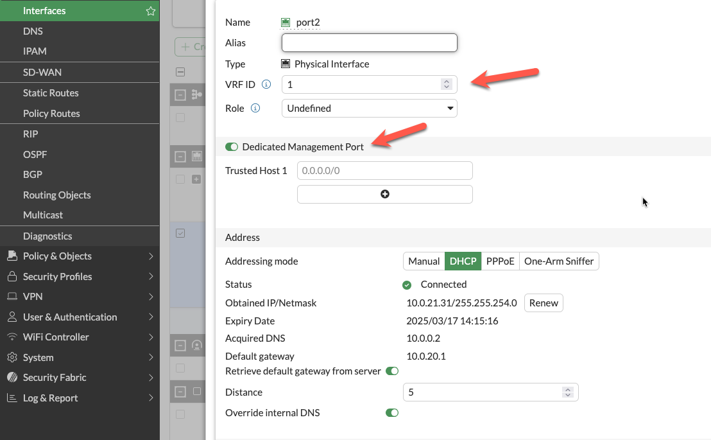
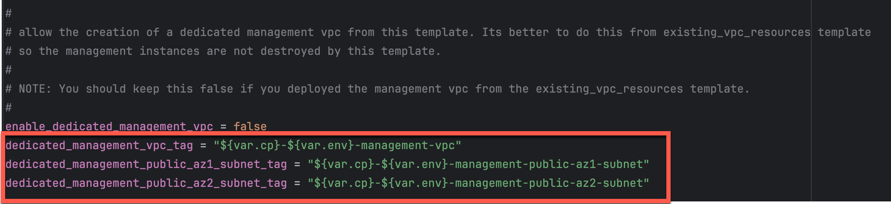

## Overview

The FortiGate autoscale solution provides multiple approaches to isolating management traffic from data plane traffic, ranging from shared interfaces to complete physical network separation.

This page covers three progressive levels of management isolation, allowing you to choose the appropriate security posture for your deployment requirements.

---

## Option 1: Combined Data + Management (Default)

### Architecture Overview

In the default configuration, port2 serves dual purposes:
- **Data plane**: Internet egress for inspected traffic (in 2-ARM mode)
- **Management plane**: GUI, SSH, SNMP access

### Configuration
```hcl
enable_dedicated_management_eni = false
enable_dedicated_management_vpc = false
```

### Characteristics
- **Simplest configuration**: No additional interfaces or VPCs required
- **Lower cost**: Minimal infrastructure overhead
- **Shared security groups**: Same rules govern data and management traffic
- **Single failure domain**: Management access tied to data plane availability

### When to Use
- Development and testing environments
- Proof-of-concept deployments
- Budget-constrained projects
- Simple architectures without compliance requirements

---

## Option 2: Dedicated Management ENI

### Architecture Overview

Port2 is removed from the data plane and dedicated exclusively to management functions. FortiOS configures the interface with `set dedicated-to management`, placing it in an isolated VRF with independent routing.


### Configuration
```hcl
enable_dedicated_management_eni = true
```

### How It Works

1. **Dedicated-to attribute**: FortiOS configures port2 with `set dedicated-to management`
2. **Separate VRF**: Port2 is placed in an isolated VRF with independent routing table
3. **Policy restrictions**: FortiGate prevents creation of firewall policies using port2
4. **Management-only traffic**: GUI, SSH, SNMP, and FortiManager/FortiAnalyzer connectivity

### FortiOS Configuration Impact

The dedicated management ENI can be verified in the FortiGate GUI:



The interface shows the `dedicated-to: management` attribute and separate VRF assignment, preventing data plane traffic from using this interface.

### Important Compatibility Notes

{}
**Critical Limitation: 2-ARM + NAT Gateway + Dedicated Management ENI**

When combining:
- `firewall_policy_mode = "2-arm"`
- `access_internet_mode = "nat_gw"`
- `enable_dedicated_management_eni = true`

Port2 will **NOT** receive an Elastic IP address. This is a valid configuration, but imposes connectivity restrictions:

- **Cannot** access FortiGate management from public internet
- **Can** access via private IP through AWS Direct Connect or VPN
- **Can** access via management VPC (see Option 3 below)

If you require public internet access to the FortiGate management interface with NAT Gateway egress, either:
1. Use `access_internet_mode = "eip"` (assigns EIP to port2)
2. Use dedicated management VPC with separate internet connectivity (Option 3)
3. Implement AWS Systems Manager Session Manager for private connectivity
{}

### Characteristics
- **Clear separation of concerns**: Management traffic isolated from data plane
- **Independent security policies**: Separate security groups for management interface
- **Enhanced security posture**: Reduces attack surface on management plane
- **Moderate complexity**: Requires additional subnet and routing configuration

### When to Use
- Production deployments requiring management isolation
- Security-conscious environments
- Architectures without dedicated management VPC
- Compliance requirements for management plane separation

---

## Option 3: Dedicated Management VPC (Full Isolation)

### Architecture Overview

The dedicated management VPC provides complete physical network separation by deploying FortiGate management interfaces in an entirely separate VPC from the data plane.


### Configuration
```hcl
enable_dedicated_management_vpc = true
dedicated_management_vpc_tag = "your-mgmt-vpc-tag"
dedicated_management_public_az1_subnet_tag = "your-az1-subnet-tag"
dedicated_management_public_az2_subnet_tag = "your-az2-subnet-tag"
```

### Benefits
- **Physical network separation**: Management traffic never traverses inspection VPC
- **Independent internet connectivity**: Management VPC has dedicated IGW or VPN
- **Centralized management infrastructure**: FortiManager and FortiAnalyzer deployed in management VPC
- **Separate security controls**: Management VPC security groups independent of data plane
- **Isolated failure domains**: Management VPC issues don't affect data plane

### Management VPC Creation Options

#### Option A: Created by existing_vpc_resources Template (Recommended)

The `existing_vpc_resources` template creates the management VPC with standardized tags that the simplified template automatically discovers.

**Advantages**:
- Management VPC lifecycle independent of inspection VPC
- FortiManager/FortiAnalyzer persistence across inspection VPC redeployments
- Separation of concerns for infrastructure management

**Default Tags** (automatically created):


**Configuration** (terraform.tfvars):
```hcl
enable_dedicated_management_vpc = true
dedicated_management_vpc_tag = "acme-test-management-vpc"
dedicated_management_public_az1_subnet_tag = "acme-test-management-public-az1-subnet"
dedicated_management_public_az2_subnet_tag = "acme-test-management-public-az2-subnet"
```

#### Option B: Use Existing Management VPC

If you have an existing management VPC with custom tags, configure the template to discover it:



**Configuration**:
```hcl
enable_dedicated_management_vpc = true
dedicated_management_vpc_tag = "my-custom-mgmt-vpc-tag"
dedicated_management_public_az1_subnet_tag = "my-custom-mgmt-public-az1-tag"
dedicated_management_public_az2_subnet_tag = "my-custom-mgmt-public-az2-tag"
```

The template uses these tags to locate the management VPC and subnets via Terraform data sources.

### Behavior When Enabled

When `enable_dedicated_management_vpc = true`:

1. **Automatic ENI creation**: Template creates dedicated management ENI (port2) in management VPC subnets
2. **Implies dedicated management ENI**: Automatically sets `enable_dedicated_management_eni = true`
3. **VPC peering/TGW**: Management VPC must have connectivity to inspection VPC for HA sync
4. **Security group creation**: Appropriate security groups created for management traffic

### Network Connectivity Requirements

**Management VPC --> Inspection VPC Connectivity**:
- Required for FortiGate HA synchronization between instances
- Typically implemented via VPC peering or Transit Gateway attachment
- Must allow TCP port 443 (HA sync), TCP 22 (SSH), ICMP (health checks)

**Management VPC --> Internet Connectivity**:
- Required for FortiGuard services (signature updates, licensing)
- Required for administrator access to FortiGate management interfaces
- Can be via Internet Gateway, NAT Gateway, or AWS Direct Connect

### Characteristics
- **Highest security posture**: Complete physical isolation
- **Greatest flexibility**: Independent infrastructure lifecycle
- **Higher complexity**: Requires VPC peering or TGW configuration
- **Additional cost**: Separate VPC infrastructure and data transfer charges

### When to Use
- Enterprise production deployments
- Strict compliance requirements (PCI-DSS, HIPAA, etc.)
- Multi-account AWS architectures
- Environments with dedicated management infrastructure
- Organizations with existing management VPCs for network security appliances

---

## Comparison Matrix

| Factor | Combined (Default) | Dedicated ENI | Dedicated VPC |
|--------|-------------------|---------------|---------------|
| **Security Isolation** | Low | Medium | High |
| **Complexity** | Lowest | Medium | Highest |
| **Cost** | Lowest | Low | Medium |
| **Management Access** | Via data plane interface | Via dedicated interface | Via separate VPC |
| **Failure Domain Isolation** | No | Partial | Complete |
| **VPC Peering Required** | No | No | Yes |
| **Compliance Suitability** | Basic | Good | Excellent |
| **Best For** | Dev/test, simple deployments | Production, security-conscious | Enterprise, compliance-driven |

---

## Decision Tree

Use this decision tree to select the appropriate management isolation level:

```
1. Is this a production deployment?
   |--- No --> Combined Data + Management (simplest)
   \--- Yes --> Continue to question 2

2. Do you have compliance requirements for management plane isolation?
   |--- No --> Dedicated Management ENI (good balance)
   \--- Yes --> Continue to question 3

3. Do you have existing management VPC infrastructure?
   |--- Yes --> Dedicated Management VPC (leverage existing)
   \--- No --> Evaluate cost/benefit:
       |--- High security requirements --> Dedicated Management VPC
       \--- Moderate requirements --> Dedicated Management ENI
```

---

## Deployment Patterns

### Pattern 1: Dedicated ENI + EIP Mode
```hcl
firewall_policy_mode = "2-arm"
access_internet_mode = "eip"
enable_dedicated_management_eni = true
```
- Port2 receives EIP for public management access
- Suitable for environments without management VPC
- Simplified deployment with direct internet management access

### Pattern 2: Dedicated ENI + Management VPC
```hcl
firewall_policy_mode = "2-arm"
access_internet_mode = "nat_gw"
enable_dedicated_management_vpc = true
dedicated_management_vpc_tag = "my-mgmt-vpc"
```
- Port2 connects to separate management VPC
- Management VPC has dedicated internet gateway or VPN connectivity
- Preferred for production environments with strict network segmentation

### Pattern 3: Combined Management (Default)
```hcl
firewall_policy_mode = "2-arm"
access_internet_mode = "eip"
enable_dedicated_management_eni = false
```
- Port2 remains in data plane
- Management access shares public interface with egress traffic
- Simplest configuration but lacks management plane isolation

---

## Best Practices

1. **Enable dedicated management ENI for production**: Provides clear separation of concerns
2. **Use dedicated management VPC for enterprise deployments**: Optimal security posture
3. **Document connectivity requirements**: Ensure operations teams understand access paths
4. **Test connectivity before production**: Verify alternative access methods work
5. **Plan for failure scenarios**: Ensure backup access methods (SSM, VPN) are available
6. **Use existing_vpc_resources template for management VPC**: Separates lifecycle management
7. **Document tag conventions**: Ensure consistent tagging across environments
8. **Monitor management interface health**: Set up CloudWatch alarms for management connectivity

---

## Troubleshooting

### Issue: Cannot access FortiGate management interface

**Check**:
1. Security groups allow inbound traffic on management port (443, 22)
2. Route tables provide path from your location to management interface
3. If using dedicated management VPC, verify VPC peering or TGW is operational
4. If using NAT Gateway mode, verify you have alternative access method (VPN, Direct Connect)

### Issue: Management interface has no public IP

**Cause**: Public IP assignment was disabled for the management interface, or using a dedicated management VPC without public subnets.

**Note**: The `access_internet_mode` variable only controls how data plane egress traffic leaves the inspection VPC (EIP vs NAT Gateway). It does not affect management interface IP assignment.

**Solutions**:
1. Enable public IP assignment for the management interface in your configuration
2. If using dedicated management VPC, ensure the management subnets have routes to an Internet Gateway
3. If public management access is not required, access FortiGate via private IP through AWS Direct Connect or VPN
4. Use AWS Systems Manager Session Manager for private access

### Issue: HA sync not working

**Note**: HA sync interfaces are always placed in dedicated sync subnets within the inspection VPC to avoid latency. They are never placed in a separate VPC. The dedicated management VPC option only affects the management interfaces (GUI/SSH access), not the HA sync interfaces.

**Check**:
1. Security groups allow TCP 703 (HA heartbeat) and TCP 23 (session sync) between FortiGate instances
2. HA sync subnets have proper route tables configured
3. Network ACLs permit required traffic between FortiGate sync interfaces
4. Verify FortiGate HA configuration matches (HA group name, password, priority settings)

---

## Next Steps

After configuring management isolation, proceed to [Licensing Options](../4_4_licensing_options/) to choose between BYOL, FortiFlex, or PAYG.
