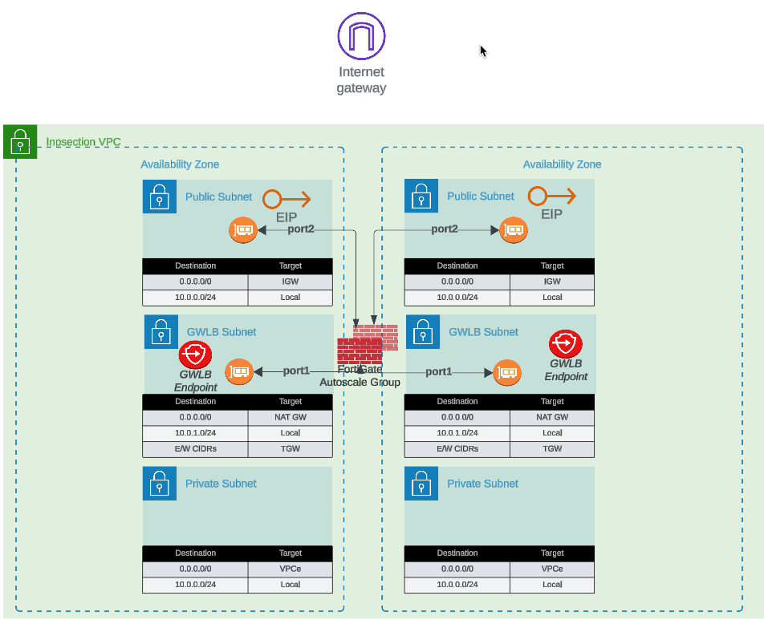

## Overview

The FortiGate autoscale solution provides two distinct architectures for internet egress traffic, each optimized for different operational requirements and cost considerations.

---

## Option 1: Elastic IP (EIP) per Instance

Each FortiGate instance in the autoscale group receives a dedicated Elastic IP address. All traffic destined for the public internet is source-NATed behind the instance's assigned EIP.

### Configuration
```hcl
access_internet_mode = "eip"
```

### Architecture Behavior

In EIP mode, the architecture routes all internet-bound traffic to port2 (the public interface). The route table for the public subnet directs traffic to the Internet Gateway (IGW), where automatic source NAT to the associated EIP occurs.



### Advantages
- **No NAT Gateway costs**: Eliminates monthly NAT Gateway charges ($0.045/hour + data processing)
- **Distributed egress**: Each instance has independent internet connectivity
- **Simplified troubleshooting**: Per-instance source IP simplifies traffic flow analysis
- **No single point of failure**: Loss of one instance's EIP doesn't affect others

### Considerations
- **Unpredictable IP addresses**: EIPs are allocated from AWS's pool; you cannot predict or specify the assigned addresses
- **Allowlist complexity**: Destinations requiring IP allowlisting must accommodate a pool of EIPs (one per maximum autoscale capacity)
- **IP churn during scaling**: Scale-out events introduce new source IPs; scale-in events remove them
- **Limited EIP quota**: AWS accounts have default limits (5 EIPs per region, increased upon request)

### Best Use Cases
- Cost-sensitive deployments where NAT Gateway charges exceed EIP allocation costs
- Environments where destination allowlisting is not required
- Architectures prioritizing distributed egress over consistent source IPs
- Development and testing environments with limited budget

---

## Option 2: NAT Gateway

All FortiGate instances share one or more NAT Gateways deployed in public subnets. Traffic is source-NATed to the NAT Gateway's static Elastic IP address.

### Configuration
```hcl
access_internet_mode = "nat_gw"
```

### Architecture Behavior

NAT Gateway mode requires additional subnet and route table configuration. Internet-bound traffic is first routed to the NAT Gateway in the public subnet, which performs source NAT to its static EIP before forwarding to the IGW.


### Advantages
- **Predictable source IP**: Single, stable public IP address for the lifetime of the NAT Gateway
- **Simplified allowlisting**: Destinations only need to allowlist one IP address (per Availability Zone)
- **High throughput**: NAT Gateway supports up to 45 Gbps per AZ
- **Managed service**: AWS handles NAT Gateway scaling and availability
- **Independent of FortiGate scaling**: Source IP remains constant during scale-in/scale-out events

### Considerations
- **Additional costs**: $0.045/hour per NAT Gateway + $0.045 per GB data processed
- **Per-AZ deployment**: Multi-AZ architectures require NAT Gateway in each AZ for fault tolerance
- **Additional subnet requirements**: Requires dedicated NAT Gateway subnet in each AZ
- **Route table complexity**: Additional route tables needed for NAT Gateway routing

### Cost Analysis Example

**Scenario**: 4 FortiGate instances processing 10 TB/month egress traffic

**EIP Mode**:
- 4 EIP allocations: $0 (first EIP free, then $0.00/hour per EIP)
- Total monthly: ~$0 (minimal costs)

**NAT Gateway Mode** (2 AZs):
- 2 NAT Gateways: 2 × $0.045/hour × 730 hours = $65.70
- Data processing: 10,000 GB × $0.045 = $450.00
- Total monthly: $515.70

**Decision Point**: NAT Gateway makes sense when consistent source IP requirement justifies the additional cost.

### Best Use Cases
- Production environments requiring predictable source IPs
- Compliance scenarios where destination IP allowlisting is mandatory
- High-volume egress traffic to SaaS providers with IP allowlisting requirements
- Architectures where operational simplicity outweighs additional cost

---

## Decision Matrix

| Factor | EIP Mode | NAT Gateway Mode |
|--------|----------|------------------|
| **Monthly Cost** | Minimal | $500+ (varies with traffic) |
| **Source IP Predictability** | Variable (changes with scaling) | Stable |
| **Allowlisting Complexity** | High (multiple IPs) | Low (single IP per AZ) |
| **Throughput** | Per-instance limit | Up to 45 Gbps per AZ |
| **Operational Complexity** | Low | Medium |
| **Best For** | Dev/test, cost-sensitive | Production, compliance-driven |

---

## Next Steps

After selecting your internet egress option, proceed to [Firewall Architecture](../4_2_firewall_architecture/) to configure the FortiGate interface model.
