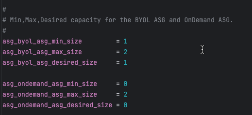

## Overview

Configure the autoscale group size parameters to define minimum, maximum, and desired instance counts for both BYOL and on-demand (PAYG) autoscale groups.

### Configuration



```hcl
# BYOL ASG capacity
asg_byol_asg_min_size         = 1
asg_byol_asg_max_size         = 2
asg_byol_asg_desired_size     = 1

# On-Demand (PAYG) ASG capacity
asg_ondemand_asg_min_size     = 0
asg_ondemand_asg_max_size     = 2
asg_ondemand_asg_desired_size = 0
```

---

## Parameter Definitions

| Parameter | Description | Recommendations |
|-----------|-------------|-----------------|
| `min_size` | Minimum number of instances ASG maintains | Set to baseline capacity requirement |
| `max_size` | Maximum number of instances ASG can scale to | Set based on peak traffic projections + 20% buffer |
| `desired_size` | Target number of instances ASG attempts to maintain | Typically equals `min_size` for baseline capacity |

---

## Capacity Planning Strategies

### Strategy 1: BYOL Baseline with PAYG Burst (Recommended)

**Objective**: Optimize costs by using BYOL for steady-state traffic and PAYG for unpredictable spikes

```hcl
# BYOL handles baseline 24/7 traffic
asg_byol_asg_min_size = 2
asg_byol_asg_max_size = 4
asg_byol_asg_desired_size = 2

# PAYG handles burst traffic only
asg_ondemand_asg_min_size = 0
asg_ondemand_asg_max_size = 6
asg_ondemand_asg_desired_size = 0
```

**Scaling behavior**:
1. Normal operations: 2 BYOL instances handle traffic
2. Traffic increases: BYOL ASG scales up to 4 instances
3. Traffic continues increasing: PAYG ASG scales from 0 → 6 instances
4. Traffic decreases: PAYG ASG scales down to 0, then BYOL ASG scales down to 2

### Strategy 2: All PAYG (Simplest)

**Objective**: Maximum flexibility with zero license management overhead

```hcl
# No BYOL instances
asg_byol_asg_min_size = 0
asg_byol_asg_max_size = 0
asg_byol_asg_desired_size = 0

# All capacity is PAYG
asg_ondemand_asg_min_size = 2
asg_ondemand_asg_max_size = 8
asg_ondemand_asg_desired_size = 2
```

**Use cases**:
- Proof of concept or testing
- Short-term projects (< 6 months)
- Extreme variability where license planning is impractical

### Strategy 3: All BYOL (Lowest Cost)

**Objective**: Minimum operating costs for long-term, predictable workloads

```hcl
# All capacity is BYOL
asg_byol_asg_min_size = 2
asg_byol_asg_max_size = 6
asg_byol_asg_desired_size = 2

# No PAYG instances
asg_ondemand_asg_min_size = 0
asg_ondemand_asg_max_size = 0
asg_ondemand_asg_desired_size = 0
```

**Requirements**:
- Sufficient BYOL licenses for `max_size` (6 in this example)
- Predictable traffic patterns that rarely exceed max capacity
- Willingness to accept capacity ceiling (no burst beyond BYOL max)

---

## CloudWatch Alarm Integration

Autoscale group scaling is triggered by CloudWatch alarms monitoring CPU utilization:

**Default thresholds** (set in underlying module):
- **Scale-out alarm**: CPU > 70% for 2 consecutive periods (2 minutes)
- **Scale-in alarm**: CPU < 30% for 2 consecutive periods (2 minutes)

**Customization** (requires editing underlying module):
```hcl
# Located in module: fortinetdev/cloud-modules/aws
scale_out_threshold = 80  # Higher threshold = more aggressive cost optimization
scale_in_threshold  = 20  # Lower threshold = more aggressive cost optimization
```

---

## Capacity Planning Calculator

**Formula**: `Capacity Needed = (Peak Gbps Throughput) / (Per-Instance Gbps) × 1.2`

**Example**: 
- Peak throughput requirement: 8 Gbps
- c6i.xlarge (4 vCPU) with IPS enabled: ~2 Gbps per instance
- Calculation: 8 / 2 × 1.2 = 4.8 → round up to **5 instances**
- Set `max_size = 5` or higher for safety margin

---

## Important Considerations

{}
**Testing Capacity Settings**

For initial deployments and testing:
1. Start with **min_size = 1** and **max_size = 2** to verify traffic flows correctly
2. Test scaling by generating load and monitoring ASG behavior
3. Once validated, increase capacity to production values via AWS Console or Terraform update
4. No need to destroy/recreate stack just to change capacity settings
{}

---

## Next Steps

After configuring capacity, proceed to [Primary Scale-In Protection](../4_7_primary_scalein_protection/) to protect the primary instance from being terminated during scale-in events.
