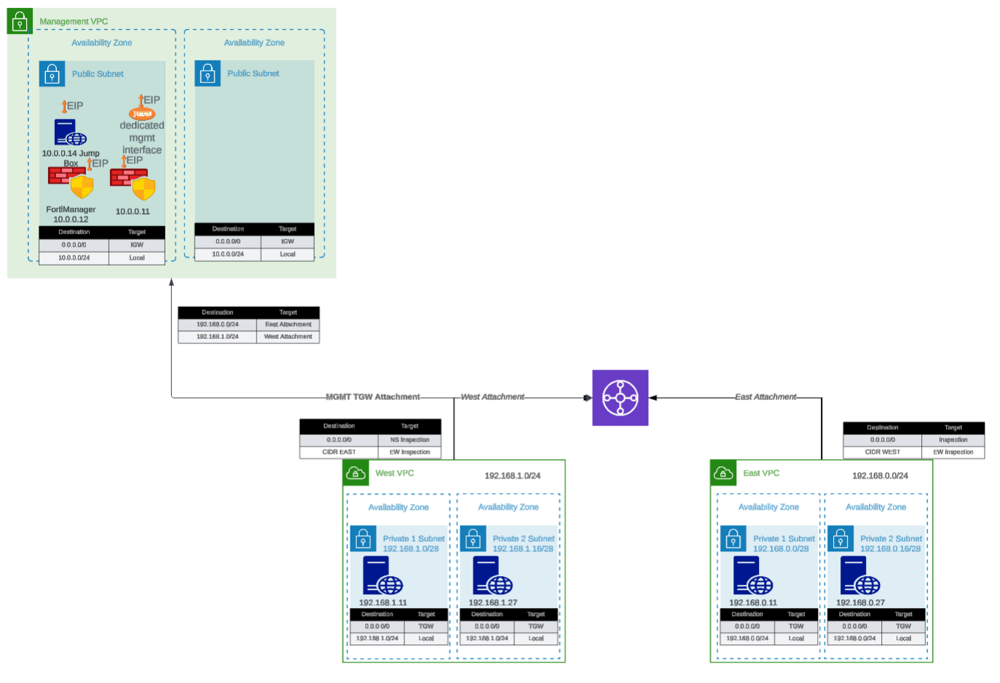

## Overview

The `existing_vpc_resources` template is a Terraform template designed for testing, demonstration, and lab environments. It creates supporting infrastructure including management VPC, Transit Gateway, spoke VPCs, and **configures the deployment mode** for either AutoScale or HA Pair FortiGate deployments.

{}
**Deploy this template FIRST** before deploying autoscale_template or ha_pair. You must choose a deployment mode during configuration.
{}

### Deployment Mode Selection

When deploying existing_vpc_resources, you **must choose ONE deployment mode**:

**AutoScale Deployment Mode** (`enable_autoscale_deployment = true`):
- Creates GWLB subnets in inspection VPC (indices 4 & 5)
- Use when planning to deploy [autoscale_template](../5_3_autoscale_template/)
- Best for elastic scaling requirements

**HA Pair Deployment Mode** (`enable_ha_pair_deployment = true`):
- Creates HA sync subnets in inspection VPC (indices 10 & 11)
- Use when planning to deploy [ha_pair template](../5_4_ha_pair/)
- Best for fixed-capacity Active-Passive deployment

{}
These deployment modes are **mutually exclusive**. The UI automatically unchecks one when you select the other.
{}

---

## What It Creates



The template conditionally creates the following components based on boolean variables:

### Component Overview

| Component | Purpose | Required | Typical Cost/Month |
|-----------|---------|----------|-------------------|
| **Inspection VPC** | Base VPC for FortiGate deployment | **Yes** | Minimal (VPC free) |
| **Deployment Mode Config** | AutoScale or HA Pair subnet creation | **Yes** | Minimal (subnets free) |
| Management VPC | Centralized management infrastructure | No | ~$50 (VPC/networking) |
| FortiManager | Policy management and orchestration | No | ~$73 (m5.large) |
| FortiAnalyzer | Logging and reporting | No | ~$73 (m5.large) |
| Jump Box | Bastion host for secure access | No | ~$7 (t3.micro) |
| Transit Gateway | Central hub for VPC interconnectivity | No | ~$36 + data transfer |
| Spoke VPCs (East/West) | Simulated workload VPCs | No | ~$50 (networking) |
| Linux Instances | HTTP servers and traffic generators | No | ~$14 (2x t3.micro) |

**Total estimated cost for complete lab**: ~$300-400/month

{}
**Minimal Deployment**: You can deploy just the Inspection VPC with deployment mode selection (~$0-5/month) and integrate with existing infrastructure.
{}

---

## Component Details

### 1. Management VPC (Optional)

**Purpose**: Centralized management infrastructure isolated from production traffic

**Components**:
- Dedicated VPC with public and private subnets across two Availability Zones
- Internet Gateway for external connectivity
- Security groups for management traffic
- Standardized resource tags for discovery by `autoscale_template`

**Configuration variable**:
```hcl
enable_build_management_vpc = true
```

**What gets created**:
```
Management VPC (10.3.0.0/16)
|---- Public Subnet AZ1 (10.3.1.0/24)
|---- Public Subnet AZ2 (10.3.2.0/24)
|---- Internet Gateway
\---- Route Tables
```

**Resource tags applied** (for autoscale_template discovery):
```
Name: {cp}-{env}-management-vpc
Name: {cp}-{env}-management-public-az1-subnet
Name: {cp}-{env}-management-public-az2-subnet
```

#### FortiManager (Optional within Management VPC)

**Configuration**:
```hcl
enable_fortimanager = true
fortimanager_instance_type = "m5.large"
fortimanager_os_version = "7.4.5"
fortimanager_host_ip = "10"  # Results in .3.0.10
```

**Access**:
- GUI: `https://<FortiManager-Public-IP>`
- SSH: `ssh admin@<FortiManager-Public-IP>`
- Default credentials: `admin` / `<instance-id>`

**Use cases**:
- Testing FortiManager integration with autoscale group
- Centralized policy management demonstrations
- Device orchestration testing

#### FortiAnalyzer (Optional within Management VPC)

**Configuration**:
```hcl
enable_fortianalyzer = true
fortianalyzer_instance_type = "m5.large"
fortianalyzer_os_version = "7.4.5"
fortianalyzer_host_ip = "11"  # Results in .3.0.11
```

**Access**:
- GUI: `https://<FortiAnalyzer-Public-IP>`
- SSH: `ssh admin@<FortiAnalyzer-Public-IP>`
- Default credentials: `admin` / `<instance-id>`

**Use cases**:
- Centralized logging for autoscale group
- Reporting and analytics demonstrations
- Log retention testing

#### Jump Box (Optional within Management VPC)

**Configuration**:
```hcl
enable_jump_box = true
jump_box_instance_type = "t3.micro"
```

**Access**:
```bash
ssh -i ~/.ssh/keypair.pem ec2-user@<jump-box-public-ip>
```

**Use cases**:
- Secure access to spoke VPC instances
- Testing connectivity without FortiGate in path (via debug attachment)
- Management access to FortiGate private IPs

#### Management VPC TGW Attachment (Optional)

**Configuration**:
```hcl
enable_mgmt_vpc_tgw_attachment = true
```

**Purpose**: Connects management VPC to Transit Gateway, allowing:
- Jump box access to spoke VPC Linux instances
- FortiManager/FortiAnalyzer access to FortiGate instances via TGW
- Alternative management access paths

**Routing**:
- Management VPC --> TGW --> Spoke VPCs
- Can be combined with `enable_debug_tgw_attachment` for bypass testing

---

### 2. Inspection VPC and Deployment Mode (Required)

**Purpose**: Base VPC infrastructure for FortiGate deployment with mode-specific subnets

The inspection VPC is always created and includes subnets based on your chosen deployment mode. This template **does not create the inspection VPC itself** (that's created by autoscale_template or ha_pair), but it **does create the deployment mode-specific subnets** that will be used by the inspection VPC.

#### AutoScale Deployment Mode

**Configuration**:
```hcl
enable_autoscale_deployment = true
```

**What gets created**:
- GWLB subnets in two Availability Zones (indices 4 & 5)
- Named: `{cp}-{env}-inspection-gwlb-az1-subnet` and `{cp}-{env}-inspection-gwlb-az2-subnet`
- Used by autoscale_template for Gateway Load Balancer endpoints

**Subnet layout**:
```
Inspection VPC Subnets (AutoScale Mode)
|---- Index 0: Public Subnet AZ1 (FortiGate Port1)
|---- Index 1: Public Subnet AZ2 (FortiGate Port1)
|---- Index 2: Private Subnet AZ1 (FortiGate Port2)
|---- Index 3: Private Subnet AZ2 (FortiGate Port2)
|---- Index 4: GWLB Subnet AZ1 <-- Created by existing_vpc_resources
\---- Index 5: GWLB Subnet AZ2 <-- Created by existing_vpc_resources
```

**When to use**: Choose AutoScale mode when deploying [autoscale_template](../5_3_autoscale_template/) for elastic scaling with Gateway Load Balancer.

#### HA Pair Deployment Mode

**Configuration**:
```hcl
enable_ha_pair_deployment = true
```

**What gets created**:
- HA sync subnets in two Availability Zones (indices 10 & 11)
- Named: `{cp}-{env}-inspection-hasync-az1-subnet` and `{cp}-{env}-inspection-hasync-az2-subnet`
- Used by ha_pair template for FGCP cluster synchronization and VPC Endpoint

**Subnet layout**:
```
Inspection VPC Subnets (HA Pair Mode)
|---- Index 0: Public Subnet AZ1 (Primary FGT Port1)
|---- Index 1: Public Subnet AZ2 (Secondary FGT Port1)
|---- Index 2: Private Subnet AZ1 (Primary FGT Port2)
|---- Index 3: Private Subnet AZ2 (Secondary FGT Port2)
|---- Index 6: TGW Subnet AZ1 (Primary FGT Port3)
|---- Index 7: TGW Subnet AZ2 (Secondary FGT Port3)
|---- Index 8: Management Subnet AZ1 (Primary FGT Port4)
|---- Index 9: Management Subnet AZ2 (Secondary FGT Port4)
|---- Index 10: HA Sync Subnet AZ1 <-- Created by existing_vpc_resources
\---- Index 11: HA Sync Subnet AZ2 <-- Created by existing_vpc_resources
```

**HA Sync Subnet Purpose**:
- **Heartbeat traffic**: HA cluster health monitoring (UDP 5405, 5406)
- **Configuration synchronization**: FortiOS config sync between Primary/Secondary
- **Session synchronization**: Active connection state sync (TCP 703)
- **VPC Endpoint access**: Private AWS API calls (EC2, TGW) without IGW

**When to use**: Choose HA Pair mode when deploying [ha_pair template](../5_4_ha_pair/) for fixed-capacity Active-Passive deployment with FGCP.

#### Deployment Mode Mutual Exclusivity

{}
**Important: Choose One Mode Only**

You **cannot** enable both deployment modes simultaneously:
- `enable_autoscale_deployment = true` --> Creates GWLB subnets (indices 4 & 5)
- `enable_ha_pair_deployment = true` --> Creates HA sync subnets (indices 10 & 11)

The UI automatically unchecks one when you select the other. Attempting to enable both will result in configuration errors.
{}

**Why separate subnet indices?**
- AutoScale uses lower indices (4 & 5) for GWLB subnets
- HA Pair uses higher indices (10 & 11) for HA sync subnets
- This prevents conflicts and allows clear separation of deployment architectures
- Each mode has different network requirements and traffic patterns

---

### 3. Transit Gateway and Spoke VPCs (Optional)

**Purpose**: Simulates production multi-VPC environment for traffic generation and testing

**Configuration variable**:
```hcl
enable_build_existing_subnets = true
```

**What gets created**:
```
Transit Gateway
|---- East Spoke VPC (192.168.0.0/24)
|   |---- Public Subnet AZ1
|   |---- Private Subnet AZ1
|   |---- NAT Gateway (optional)
|   \---- Linux Instance (optional)
|
|---- West Spoke VPC (192.168.1.0/24)
|   |---- Public Subnet AZ1
|   |---- Private Subnet AZ1
|   |---- NAT Gateway (optional)
|   \---- Linux Instance (optional)
|
\---- TGW Route Tables
    |---- Spoke-to-Spoke (via inspection VPC)
    \---- Inspection-to-Internet
```

#### Transit Gateway

**Configuration**:
```hcl
# Created automatically when enable_build_existing_subnets = true
# Named: {cp}-{env}-tgw
```

**Purpose**:
- Central hub for VPC interconnectivity
- Enables centralized egress architecture
- Allows east-west traffic inspection

**Attachments**:
- East Spoke VPC
- West Spoke VPC
- Inspection VPC (created by autoscale_template)
- Management VPC (if `enable_mgmt_vpc_tgw_attachment = true`)
- Debug attachment (if `enable_debug_tgw_attachment = true`)

#### Spoke VPCs (East and West)

**Configuration**:
```hcl
vpc_cidr_east = "192.168.0.0/24"
vpc_cidr_west = "192.168.1.0/24"
vpc_cidr_spoke = "192.168.0.0/16"  # Supernet
```

**Components per spoke VPC**:
- Public and private subnets
- NAT Gateway for internet egress
- Route tables for internet and TGW connectivity
- Security groups for instance access

#### Linux Instances (Traffic Generators)

**Configuration**:
```hcl
enable_east_linux_instances = true
east_linux_instance_type = "t3.micro"

enable_west_linux_instances = true
west_linux_instance_type = "t3.micro"
```

**What they provide**:
- HTTP server on port 80 (for connectivity testing)
- Internet egress capability (for testing FortiGate inspection)
- East-West traffic generation between spoke VPCs

**Testing with Linux instances**:
```bash
# From jump box or another instance
curl http://<linux-instance-ip>
# Returns: "Hello from <hostname>"

# Generate internet egress traffic
ssh ec2-user@<linux-instance-ip>
curl http://www.google.com  # Traffic goes through FortiGate
```

#### Debug TGW Attachment (Optional)

**Configuration**:
```hcl
enable_debug_tgw_attachment = true
```

**Purpose**: Creates a **bypass attachment** from Management VPC directly to Transit Gateway, allowing traffic to flow:
```
Jump Box --> TGW --> Spoke VPC Linux Instances (bypassing FortiGate inspection)
```

**Debug path use cases**:
- Validate spoke VPC connectivity independent of FortiGate inspection
- Compare latency/throughput with and without inspection
- Troubleshoot routing issues by eliminating FortiGate as variable
- Generate baseline traffic patterns for capacity planning

{}
**Security Consideration**

The debug attachment bypasses FortiGate inspection entirely. **Do not enable in production environments**. This is strictly for testing and validation purposes.
{}

---

## Documentation Sections

This documentation is organized into the following sections:

- **[Configuration Scenarios](52_2_scenarios/)** - Common deployment patterns and use cases
- **[Step-by-Step Deployment](52_3_deployment/)** - Complete deployment guide with examples
- **[Operations & Troubleshooting](52_4_operations/)** - Post-deployment configuration, troubleshooting, and cleanup procedures
